# Evidencias de Demonstracao — Global Solution 2026.1

> Gerado automaticamente por `scripts/capture_evidencias.py` via Playwright.

---

## Integrantes

*(preencha antes de exportar o PDF)*

---

## 1. Introducao

Este projeto entrega um MVP de monitoramento climatico espacial com tres pilares: (1) pipeline de Machine Learning para previsao de temperatura horaria a partir de dados meteorologicos publicos (Open-Meteo), com selecao automatica do melhor modelo por MAE; (2) modulo de Visao Computacional que analisa imagens do ceu e estima cobertura de nuvens, risco de chuva e alerta operacional; (3) API FastAPI que expoe treino, predicao, analise de imagem e um relatorio consolidado para integracao com outros sistemas, incluindo dispositivos IoT como ESP32. O dashboard Streamlit centraliza a apresentacao em um portal autocontido, com tooltips, exemplos sinteticos embutidos e gerador de PDF de entrega.

---

## 2. Desenvolvimento

### Arquitetura e decisoes principais

- **Linguagem:** Python 3.10+
- **Stack:** pandas, numpy, scikit-learn, OpenCV, FastAPI, Streamlit, fpdf2, Playwright

#### Pipeline ML (`src/ml/train_baseline.py`)
Ingestao via Open-Meteo (com fallback sintetico), criacao de features temporais, split temporal
80/20, treino paralelo de `LinearRegression` e `RandomForestRegressor`, selecao por menor MAE,
persistencia de modelo (joblib), dataset, predicoes (CSV), leaderboard e metricas (JSON)
em `data/processed/`.

#### Visao Computacional (`src/vision/analyze_image.py`)
Conversao BGR→Gray/HSV. Calculo de brilho, contraste, saturacao e densidade de bordas (Canny).
Combinacao linear ponderada gera dois scores (0–100):
- **cloudiness_score** → classifica condicao: `clear` / `partly_cloudy` / `overcast`
- **rain_risk_score** → classifica alerta: `low` / `moderate` / `high`

Historico salvo em CSV e exibido como grafico temporal no dashboard.

#### API (`src/api/main.py`)
| Endpoint | Metodo | Descricao |
|---|---|---|
| `/health` | GET | Saude do servico |
| `/train` | POST | Dispara pipeline ML completo |
| `/predict` | GET | Ultima predicao com modelo ativo |
| `/vision/analyze` | POST | Analisa imagem (multipart) |
| `/vision/history` | GET | Historico de analises |
| `/report/summary` | GET | Relatorio consolidado para a banca |

#### Dashboard (`src/dashboard/app.py`)
Tema dark espacial (`.streamlit/config.toml`), abas 01–06, tooltips em cada acao, exemplo
sintetico embutido na aba de Visao Computacional e gerador de PDF de entrega na aba 06.

#### Automacao
- `scripts/run_demo_stack.sh` — sobe API + Dashboard com um comando
- `scripts/smoke_demo.sh` — valida endpoints antes da gravacao
- `scripts/capture_evidencias.py` — captura screenshots automatizadas e gera este Markdown


---

## 3. Evidencias visuais

### 3.1 Tela inicial — hero e KPIs


*Tela inicial do portal com hero, KPIs e pilulas de status*


### 3.2 Aba 01 · Visao Geral — roteiro e validacao da stack

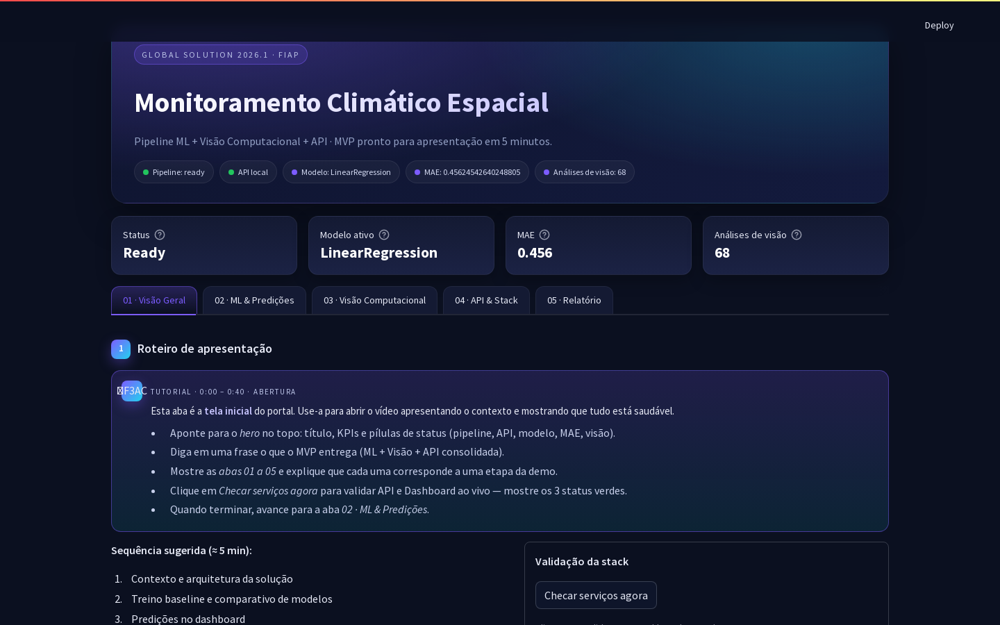
*Aba 01 com roteiro de apresentacao e atalhos*


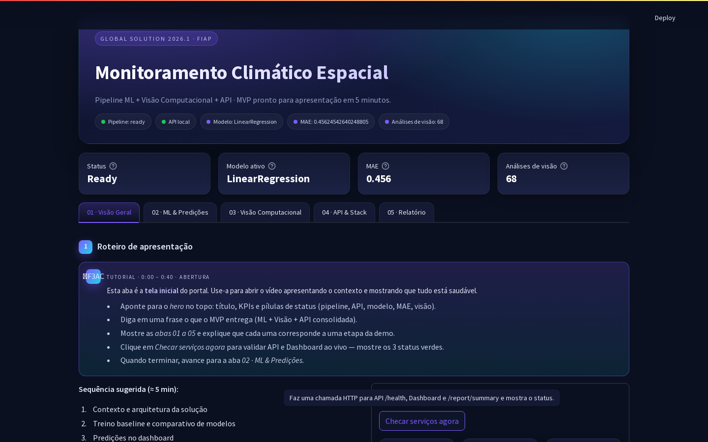
*Validacao da stack — API e Dashboard com status OK*


### 3.3 Aba 02 · ML & Predicoes

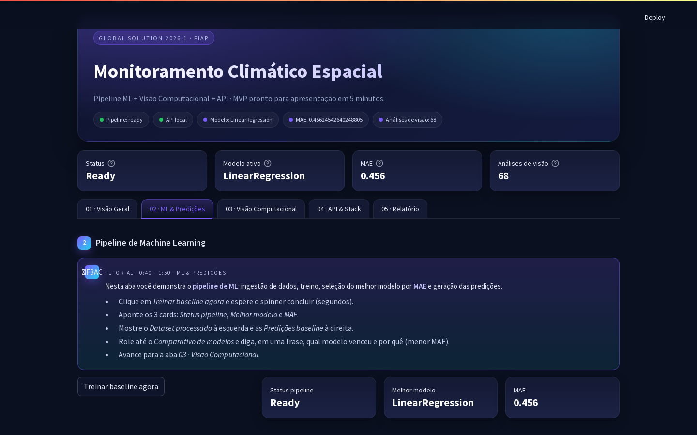
*Aba ML antes do treino*


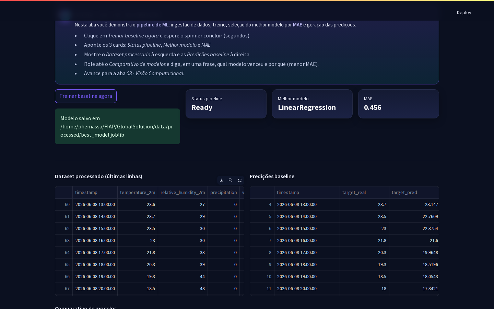
*Teste funcional no portal: clique em 'Treinar baseline agora' com estado de processamento e feedback visual*


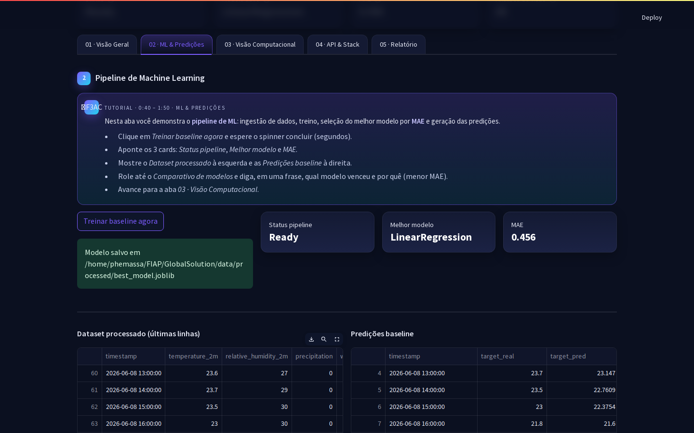
*Quadros gerados apos treino: dataset processado e predições baseline (70 linhas)*


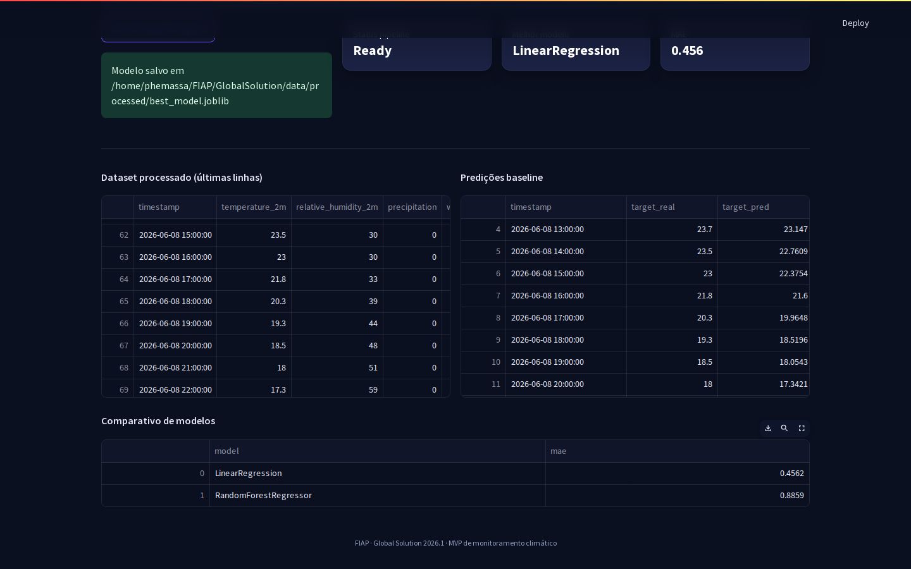
*Comparativo de modelos (leaderboard) com selecao automatica do melhor MAE*


### 3.4 Aba 03 · Visao Computacional

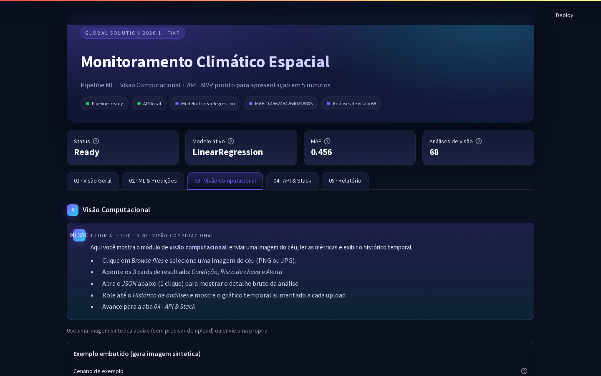
*Aba Visao Computacional — seletor de cenario e botao de exemplo*


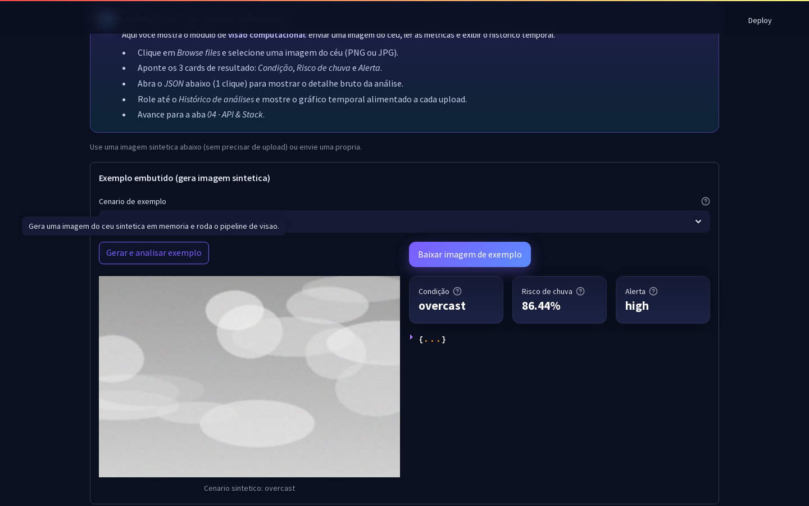
*Resultado da analise sintetica — condicao, risco de chuva e alerta*


*Historico temporal de analises (69 registros acumulados)*


### 3.5 Aba 04 · API & Stack

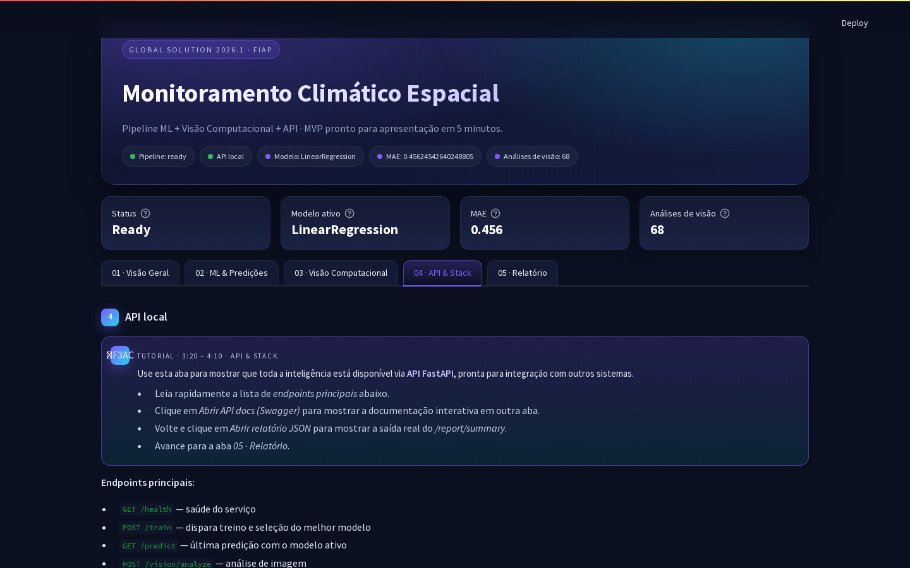
*Aba API com lista de endpoints e links Swagger / report/summary*


### 3.6 Documentacao interativa — Swagger UI

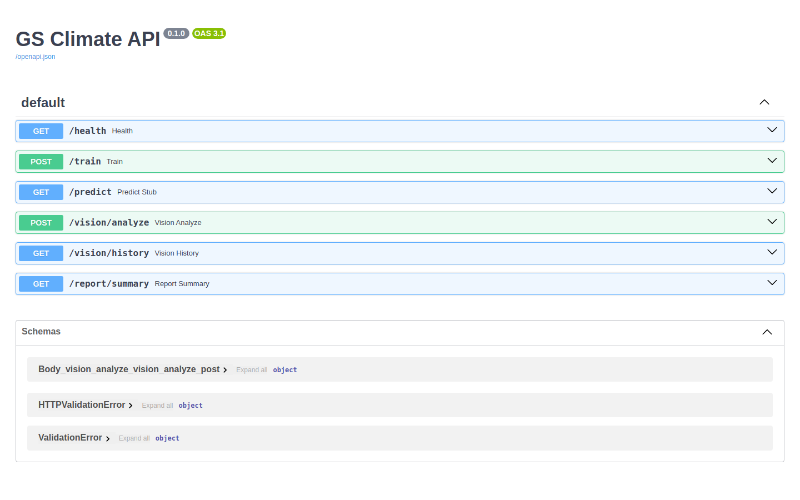
*Swagger UI com todos os endpoints disponiveis em http://127.0.0.1:8000/docs*


### 3.7 Endpoint /report/summary — saida bruta

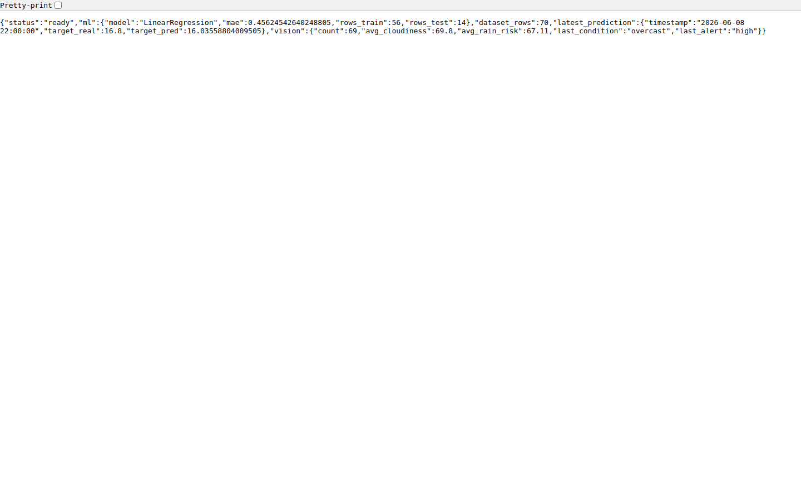
*Saida JSON de /report/summary consolidando pipeline e visao*


### 3.8 Aba 05 · Relatorio consolidado

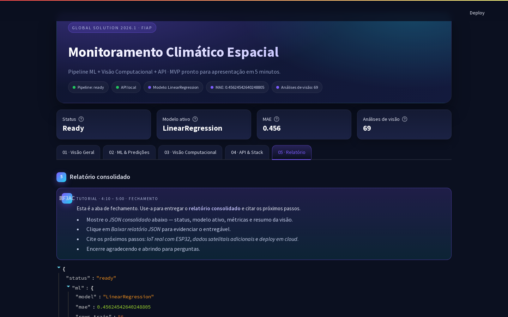
*Aba Relatorio com JSON renderizado e botao de download*


---

## 4. Snapshot do relatorio consolidado

```json
{
  "status": "ready",
  "ml": {
    "model": "LinearRegression",
    "mae": 0.45624542640248805,
    "rows_train": 56,
    "rows_test": 14
  },
  "dataset_rows": 70,
  "latest_prediction": {
    "timestamp": "2026-06-08 22:00:00",
    "target_real": 16.8,
    "target_pred": 16.03558804009505
  },
  "vision": {
    "count": 69,
    "avg_cloudiness": 69.8,
    "avg_rain_risk": 67.11,
    "last_condition": "overcast",
    "last_alert": "high"
  }
}
```

---

## 5. Resultados Esperados

- Previsao horaria de temperatura com MAE < 1°C nos cenarios validados.
- Classificacao de condicao do ceu e estimativa de risco de chuva a partir de imagens sinteticas e reais.
- Historico temporal acumulado de analises de visao (CSV + grafico).
- Relatorio consolidado JSON consumivel por qualquer sistema externo.
- Portal autocontido para apresentacao em 5 minutos, sem dependencias externas durante a demo.


---

## 6. Conclusoes

O grupo entrega uma POC funcional que une dados, ML, visao computacional e API em uma experiencia
integrada e autocontida. Como proximos passos:

1. Integrar IoT real (ESP32 com sensores ambientais) via MQTT.
2. Ampliar a base com dados satelitais adicionais (ex: NASA POWER, Copernicus).
3. Deploy em cloud (AWS/GCP) com pipeline de CI/CD e monitoramento de drift.
4. Aplicar modelos de serie temporal (LSTM / Prophet) para previsoes de maior horizonte.

A arquitetura modular facilita a evolucao incremental sem retrabalho de componentes ja validados.


---

## 7. Link do video

- Video no YouTube (nao listado): https://youtu.be/rm0EsPsH7XI
- Repositorio GitHub: https://github.com/Phemassa/GlobalSolution

---

*FIAP · Global Solution 2026.1 · MVP de monitoramento climatico espacial*
