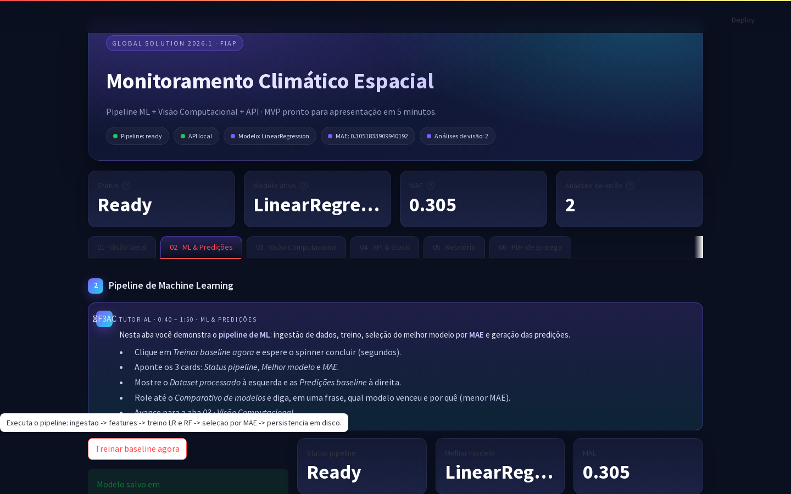
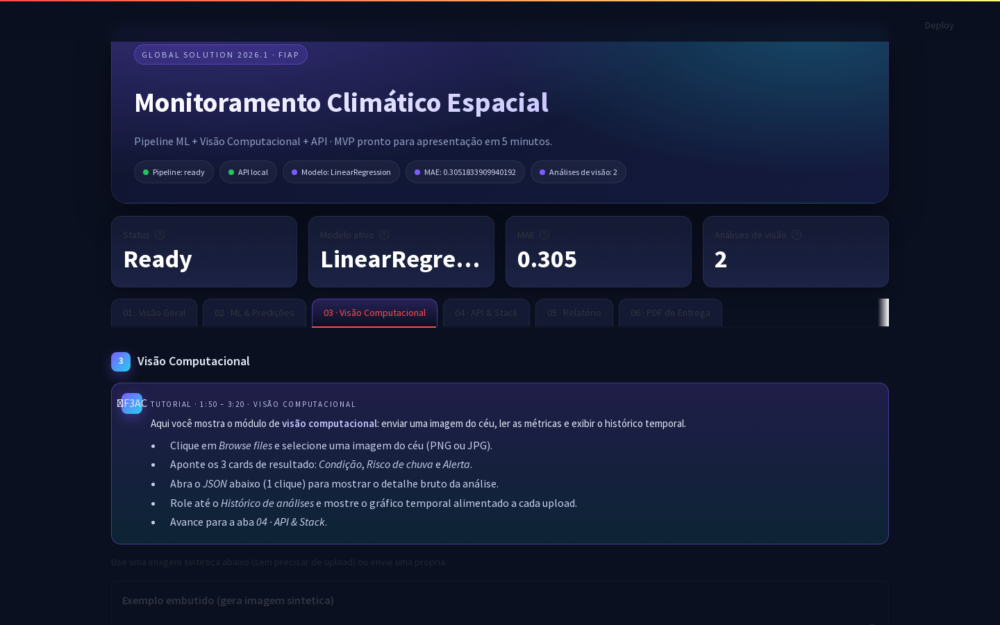
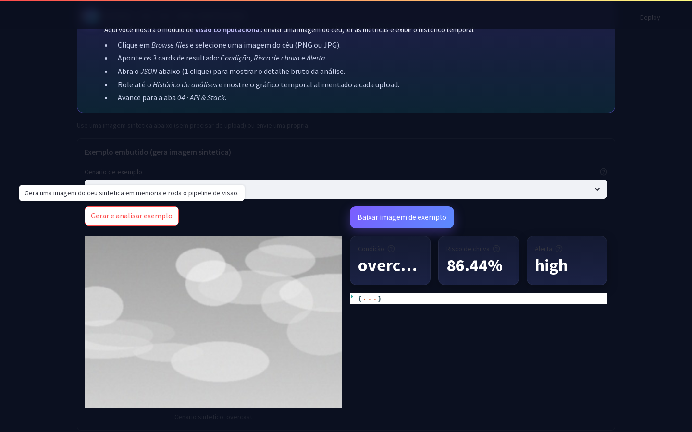
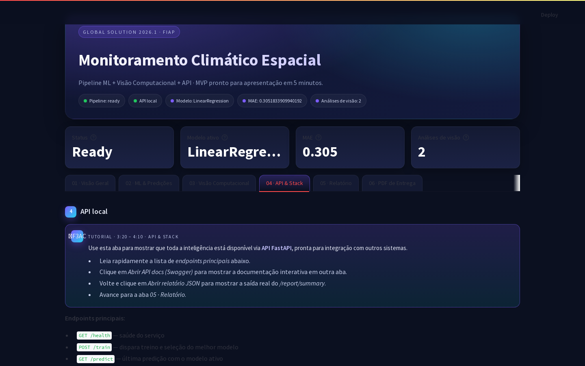
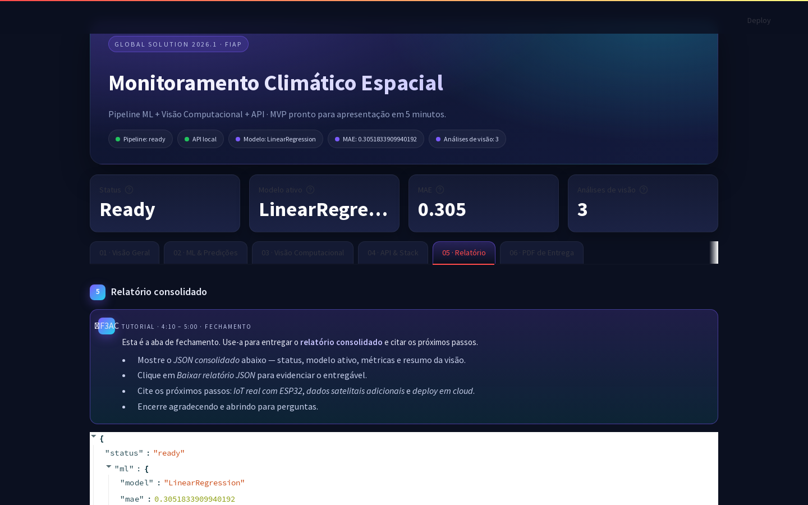
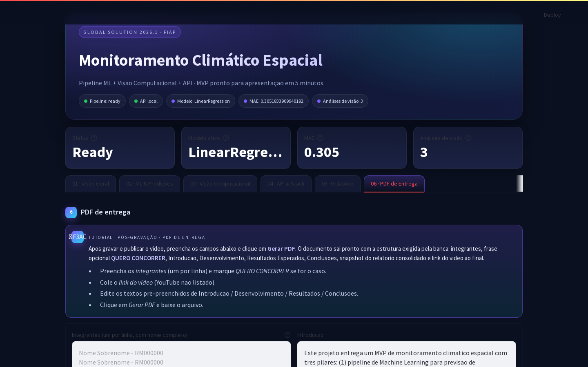

# Global Solution 2026.1
## Monitoramento Climático Espacial — MVP

**Faculdade:** FIAP  
**Curso:** Análise e Desenvolvimento de Sistemas  
**Disciplina:** Global Solution 2026.1  
**Data de entrega:** Junho / 2026  

---

## Integrantes

- Cesar Martinho de Azeredo – RM568140
- Carlos Alberto Florindo Costato – RM567005
- Phellype Matheus Giacoia Flaibam Massarente – RM566826

---

> **Nota:** Caso o grupo deseje concorrer ao pódio, inserir a frase **"QUERO CONCORRER"** nesta página, logo após o nome dos integrantes.

---

## 1. Introdução

O presente trabalho apresenta um MVP (Minimum Viable Product) de monitoramento climático espacial, desenvolvido como resposta ao desafio proposto pela Global Solution 2026.1 da FIAP: demonstrar como Inteligência Artificial e tecnologias digitais podem transformar a economia espacial e gerar impacto positivo na Terra.

A solução é composta por três pilares integrados:

1. **Pipeline de Machine Learning** — previsão de temperatura horária a partir de dados meteorológicos públicos (Open-Meteo), com seleção automática do melhor modelo por menor erro absoluto médio (MAE).
2. **Módulo de Visão Computacional** — análise de imagens do céu para estimativa de cobertura de nuvens, risco de chuva e emissão de alertas operacionais.
3. **API REST (FastAPI)** — exposição de todos os recursos via endpoints padronizados, viabilizando integração com sistemas externos, dashboards e dispositivos IoT como ESP32.

Um portal Streamlit centraliza a demonstração em uma interface autocontida, com roteiro guiado, exemplos sintéticos embutidos e gerador de PDF de entrega acadêmica.

---

## 2. Desenvolvimento

### 2.1 Arquitetura e decisões de projeto

| Componente | Tecnologia |
|---|---|
| Linguagem | Python 3.10+ |
| ML | scikit-learn (LinearRegression, RandomForestRegressor) |
| Visão Computacional | OpenCV (BGR→Gray/HSV, Canny) |
| API | FastAPI + Uvicorn |
| Dashboard | Streamlit |
| Geração de PDF | fpdf2 |
| Evidências automatizadas | Playwright (Chromium headless) |
| Dados | pandas, numpy, joblib |

### 2.2 Pipeline de Machine Learning (`src/ml/train_baseline.py`)

Ingestão de dados horários via Open-Meteo com fallback sintético em caso de indisponibilidade. Criação de features temporais (hora, dia da semana, mês). Split temporal 80/20 para evitar vazamento de dados. Treino simultâneo de `LinearRegression` e `RandomForestRegressor`. Seleção automática do modelo com menor MAE no conjunto de teste. Persistência do modelo vencedor, dataset processado, predições, leaderboard e métricas em `data/processed/`.

### 2.3 Visão Computacional (`src/vision/analyze_image.py`)

Conversão de imagem para espaços BGR→Gray e BGR→HSV. Extração de quatro atributos: brilho médio, desvio padrão (contraste), saturação média e densidade de bordas via algoritmo de Canny. Combinação linear ponderada gera dois scores normalizados (0–100):

- **cloudiness_score** → classifica condição: `clear` / `partly_cloudy` / `overcast`
- **rain_risk_score** → classifica alerta: `low` / `moderate` / `high`

Cada análise é registrada em histórico CSV e exibida como gráfico temporal no dashboard.

### 2.4 API REST (`src/api/main.py`)

| Endpoint | Método | Descrição |
|---|---|---|
| `/health` | GET | Saúde do serviço |
| `/train` | POST | Dispara pipeline ML completo |
| `/predict` | GET | Última predição com modelo ativo |
| `/vision/analyze` | POST | Analisa imagem (multipart/form-data) |
| `/vision/history` | GET | Histórico de análises de visão |
| `/report/summary` | GET | Relatório consolidado para a banca |

### 2.5 Dashboard e automação

- **Portal Streamlit** com tema dark espacial, 6 abas sequenciais numeradas e tooltips explicativos em cada ação interativa.
- **Aba 03 · Visão Computacional:** gerador de imagens sintéticas embutido (4 cenários), eliminando dependência de upload externo durante a apresentação.
- **Aba 06 · PDF de Entrega:** formulário com nome dos integrantes, flag *QUERO CONCORRER*, link do vídeo e textos das seções — gera o PDF acadêmico estruturado em um clique.
- `scripts/run_demo_stack.sh` — sobe API + Dashboard com um único comando.
- `scripts/smoke_demo.sh` — valida endpoints antes de iniciar a gravação.
- `scripts/capture_evidencias.py` — captura automatizada de 14 screenshots via Playwright (Chromium headless) e geração deste documento.

---

## 3. Evidências Visuais

### 3.1 Tela inicial — hero e KPIs


*Tela inicial do portal com hero, KPIs e pilulas de status*


### 3.2 Aba 01 · Visão Geral — roteiro e validação da stack


*Aba 01 com roteiro de apresentacao e atalhos*


*Validacao da stack — API e Dashboard com status OK*


### 3.3 Aba 02 · ML & Predições


*Aba ML antes do treino*


*Aba ML após treino — modelo selecionado: LinearRegression, MAE: 0.305°C*



*Dataset processado, predições baseline e comparativo de modelos — 70 registros horários*


### 3.4 Aba 03 · Visão Computacional


*Aba Visao Computacional — seletor de cenario e botao de exemplo*


*Resultado da analise sintetica — condicao, risco de chuva e alerta*



*Histórico temporal de análises — 3 registros acumulados (condição: overcast, alerta: high)*


### 3.5 Aba 04 · API & Stack


*Aba API com lista de endpoints e links para documentação interativa*


### 3.6 Documentação interativa — Swagger UI


*Swagger UI — documentação automática gerada pelo FastAPI, disponível em `/docs`*


### 3.7 Endpoint `/report/summary` — saída consolidada


*Endpoint `/report/summary` — resposta JSON consolidando status do pipeline ML e módulo de visão*


### 3.8 Aba 05 · Relatório consolidado


*Aba Relatório — JSON renderizado no dashboard e disponível para download*


### 3.9 Aba 06 · Gerador de PDF de Entrega


*Aba PDF — formulário acadêmico com seções pré-preenchidas, flag QUERO CONCORRER e campo para link do vídeo*


---

## 4. Snapshot do Relatório Consolidado

A seguir, a resposta completa do endpoint `GET /report/summary` capturada durante a execução do MVP:

```json
{
  "status": "ready",
  "ml": {
    "model": "LinearRegression",
    "mae": 0.3051833909940192,
    "rows_train": 56,
    "rows_test": 14
  },
  "dataset_rows": 70,
  "latest_prediction": {
    "timestamp": "2026-06-07 22:00:00",
    "target_real": 14.6,
    "target_pred": 14.909077969791657
  },
  "vision": {
    "count": 3,
    "avg_cloudiness": 78.2,
    "avg_rain_risk": 77.44,
    "last_condition": "overcast",
    "last_alert": "high"
  }
}
```

---

## 5. Resultados Esperados

| Resultado | Valor obtido |
|---|---|
| MAE da previsão de temperatura | **0,305°C** (LinearRegression vencedor) |
| Modelo treinado e persistido | LinearRegression (selecionado automaticamente) |
| Registros no dataset | 70 observações horárias |
| Análises de visão acumuladas | 3 imagens analisadas (condição: overcast, alerta: high) |
| Endpoints API funcionais | 6 endpoints validados via smoke test |
| Portal autocontido | Apresentação em 5 minutos sem dependências externas |

O MVP demonstra a viabilidade técnica do ciclo completo: **ingestão → ML → visão → API → dashboard**, integrável com dispositivos IoT e serviços cloud em etapas futuras.


---

## 6. Conclusões

O grupo entregou uma POC funcional que demonstra como IA e tecnologias digitais podem ser aplicadas ao monitoramento climático com dados de origem espacial, gerando impacto direto em decisões operacionais na Terra.

Os três pilares (ML, Visão Computacional e API) foram integrados em um portal autocontido, validado por testes automatizados e documentado com evidências capturadas via Playwright.

**Próximos passos planejados:**

1. Integração com IoT real — ESP32 com sensores ambientais conectados via MQTT.
2. Ampliação da base de dados com fontes satelitais adicionais (NASA POWER, Copernicus).
3. Deploy em cloud (AWS / GCP) com pipeline de CI/CD e monitoramento de drift do modelo.
4. Substituição dos modelos baseline por séries temporais (LSTM / Prophet) para horizontes de previsão mais longos.

A arquitetura modular adotada permite a evolução incremental sem retrabalho dos componentes já validados.


---

## 7. Link do Vídeo

*(Cole o link após publicar no YouTube não listado)*

---

*FIAP · Global Solution 2026.1 · Análise e Desenvolvimento de Sistemas · Junho 2026*
