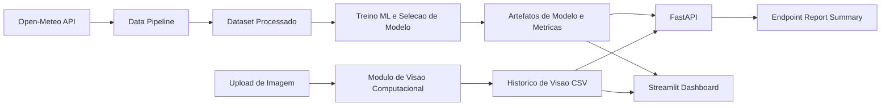

# Arquitetura MVP

```mermaid
flowchart LR
    A[Open-Meteo API] --> B[Data Pipeline]
    B --> C[Dataset Processado]
    C --> D[Treino ML e Selecao de Modelo]
    D --> E[Artefatos de Modelo e Metricas]

    F[Upload de Imagem] --> G[Modulo de Visao Computacional]
    G --> H[Historico de Visao CSV]

    E --> I[FastAPI]
    H --> I
    E --> J[Streamlit Dashboard]
    H --> J
    I --> K[Endpoint Report Summary]
```
