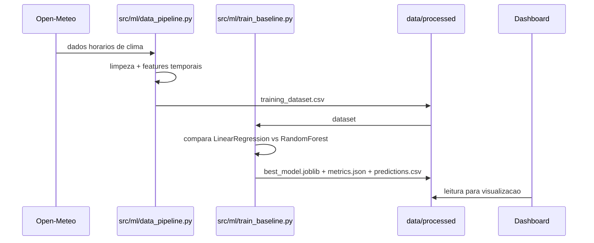

# Pipeline de Dados Climaticos

```mermaid
sequenceDiagram
    participant API as Open-Meteo
    participant PIPE as src/ml/data_pipeline.py
    participant ML as src/ml/train_baseline.py
    participant STORE as data/processed
    participant DASH as Dashboard

    API->>PIPE: dados horarios de clima
    PIPE->>PIPE: limpeza + features temporais
    PIPE->>STORE: training_dataset.csv
    STORE->>ML: dataset
    ML->>ML: compara LinearRegression vs RandomForest
    ML->>STORE: best_model.joblib + metrics.json + predictions.csv
    DASH->>STORE: leitura para visualizacao
```
