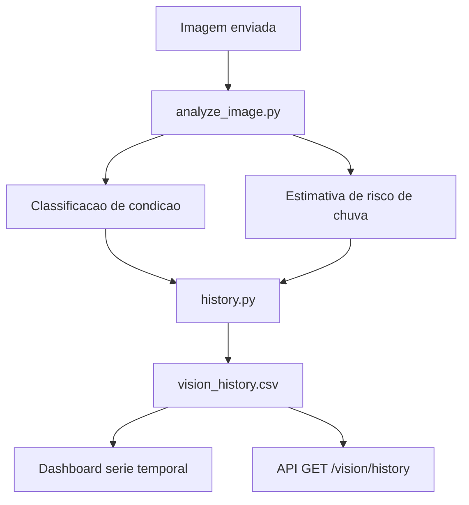

# Pipeline de Visao Computacional

```mermaid
flowchart TD
    A[Imagem enviada] --> B[analyze_image.py]
    B --> C[Classificacao de condicao]
    B --> D[Estimativa de risco de chuva]
    C --> E[history.py]
    D --> E
    E --> F[vision_history.csv]
    F --> G[Dashboard serie temporal]
    F --> H[API GET /vision/history]
```
